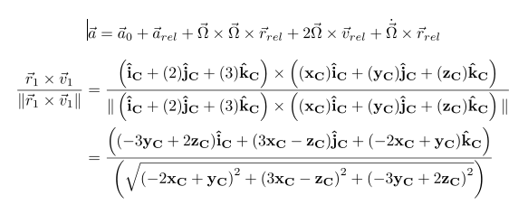
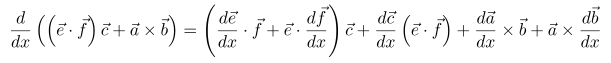
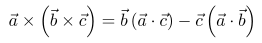
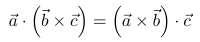
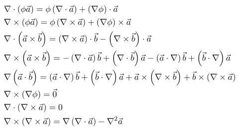
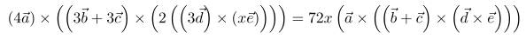
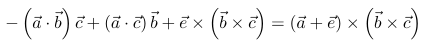
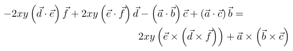

# Vector Expressions for Sympy

## Motivation

With Sympy we can write general symbolic expressions using symbols, functions, numbers, etc. Similarly, we can write symbolic matrix expressions using the `MatrixExpr` module. We can also substitute dense or sparse matrices into those symbolic expressions.

Unfortunately, vector expressions (involving dot and cross products, magnitude, divergence, curl, etc.) are not implemented in Sympy. This module is a highly experimental attempt at implementing **vector expressions**. 

## Mathematics implimented by the module

The SymPy Symbolic Vector module will implement the mainstream Gibbs/Heaviside vector algebra and calculus.  The module focuses on manipulating vector algebra and differential vector expressions.  The module focuses on these operations because of the multitude of identities and definitions in this domain.  SymPy is well suited to using these identities to grind through complicated vector expressions.
	
At this time, support for Clifford vector algebra (or other vector algebras) is not included.  Additionally, extensions into tensors (such as taking the gradient of a vector function) is not supported.  
	
Vector integral theorems, such as Greens, Stokes, etc., all require considerable mathematical machinery, for instance, defining a closed surface's relationship to a volume. These theorems are very useful to *conceptually* simplify a vector expression. However, the theorems are not well suited to *mechanistic* simplification procedures, which is what computer algebra system excel at.  Therefore, no vector integral theorems are implemented as simplification methods in the Symbolic Vector module.

## Current Status

At the moment, only basic functionalities and printing are implemented. Large portions of the code need to be re-engineered and/or rewritten.

Take a look at the Jupyter notebooks in the **Tutorial** folder to learn the intended functionality. Additionally, take a look at the `tests` folder to see example of this module usage.

Finally, feel free to help with the development.

### TODO

* Vector functions, inherited from the Function class
* Fully implimenting the **kind** attribute
* Derivatives of functions  - remove the D class ??
* Operation precedence
* Printing need some works
* Solve for vector expressions
* how to treat gradients

## Features

### Derivatives

### Identities

### Expansion

### Collection

### Simplification

